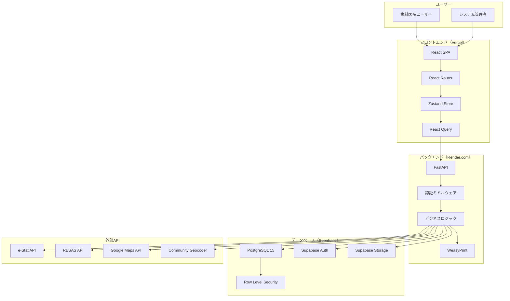
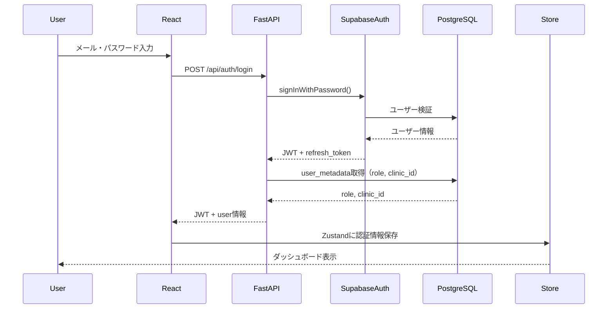

# MA-Pilot アーキテクチャ設計

## 概要

MA-Pilotは、フロントエンド（React）、バックエンド（FastAPI）、データベース（Supabase）の3層アーキテクチャで構成されたSaaSアプリケーションです。

### アーキテクチャの特徴

- **マイクロサービス指向**: フロントエンド・バックエンドを分離し、独立したデプロイを実現
- **サーバーレス**: VercelとRender.comで自動スケール
- **セキュアバイデザイン**: Supabase RLSによるデータ分離、JWT認証
- **外部API統合**: e-Stat、RESAS、Google Maps等の政府・サードパーティAPIを活用

---

## システム全体構成図



---

## フロントエンドアーキテクチャ

### 技術スタック

- **React 18**: UIライブラリ
- **TypeScript 5**: 型安全
- **Vite 5**: 高速ビルドツール
- **MUI v6**: UIコンポーネント
- **Zustand**: グローバル状態管理
- **React Query**: サーバー状態管理・キャッシング
- **React Router v6**: ルーティング
- **React Hook Form**: フォーム管理

### ディレクトリ構造

```
frontend/src/
├── pages/           # ページコンポーネント（ルートと1対1対応）
├── components/      # 共通コンポーネント
├── services/        # API通信サービス
├── stores/          # Zustand状態管理
├── hooks/           # カスタムフック
├── types/           # TypeScript型定義
├── theme/           # MUIテーマ設定
├── utils/           # ユーティリティ関数
├── layouts/         # レイアウトコンポーネント
└── lib/             # 外部ライブラリ設定
```

### 状態管理戦略

#### Zustand（グローバル状態）

- 認証情報（user、role、clinic_id）
- UIステート（サイドバー開閉、テーマ等）

#### React Query（サーバー状態）

- APIから取得したデータのキャッシング
- 自動再取得（staleTime: 5分）
- バックグラウンド更新

#### ローカルステート

- フォーム入力値（React Hook Form）
- 一時的なUIステート（useState）

### データフロー

```
ユーザー操作
  ↓
ページコンポーネント
  ↓
サービス層（API通信）
  ↓
React Query（キャッシュ）
  ↓
Zustand Store（必要に応じて）
  ↓
UIコンポーネント再レンダリング
```

---

## バックエンドアーキテクチャ

### 技術スタック

- **Python 3.11+**: プログラミング言語
- **FastAPI**: 高速Webフレームワーク
- **Pydantic**: データバリデーション
- **Supabase SDK**: PostgreSQL + Auth
- **WeasyPrint**: PDF生成
- **Pandas**: データ分析

### ディレクトリ構造

```
backend/
├── src/
│   ├── api/         # APIエンドポイント
│   ├── core/        # 設定・データベース接続
│   ├── models/      # Pydanticモデル
│   └── services/    # ビジネスロジック
├── templates/       # PDF生成テンプレート（Jinja2）
├── tests/           # テストコード
├── main.py          # FastAPIエントリーポイント
└── requirements.txt
```

### レイヤー構造

#### 1. APIレイヤー（src/api/）

- リクエスト受付
- 入力バリデーション（Pydantic）
- レスポンス生成

#### 2. サービスレイヤー（src/services/）

- ビジネスロジック
- データベース操作
- 外部API連携
- PDF生成

#### 3. データレイヤー（Supabase）

- PostgreSQL CRUD操作
- RLSによる権限制御
- トランザクション管理

### データフロー

```
HTTPリクエスト
  ↓
FastAPI Router
  ↓
認証ミドルウェア（JWT検証）
  ↓
Pydanticバリデーション
  ↓
サービス層（ビジネスロジック）
  ↓
Supabase SDK（データベース操作）
  ↓
PostgreSQL + RLS
  ↓
レスポンス生成
```

---

## データベースアーキテクチャ

### Supabase構成

- **PostgreSQL 15**: リレーショナルデータベース
- **Row Level Security**: clinic_idベースのデータ分離
- **Supabase Auth**: JWT認証・ユーザー管理
- **Supabase Storage**: PDF・画像ファイル保存
- **Supabase Realtime**: WebSocket接続（将来拡張）

### RLSポリシー設計

すべてのテーブルで以下のロジックを適用:

```sql
-- 医院スタッフは自医院データのみアクセス可
clinic_id IN (SELECT clinic_id FROM user_metadata WHERE user_id = auth.uid())

-- システム管理者は全データアクセス可
EXISTS (SELECT 1 FROM user_metadata WHERE user_id = auth.uid() AND role = 'system_admin')
```

### データ分離戦略

- **医院単位分離**: clinic_idでRLS適用
- **ユーザー権限**: user_metadata.roleで操作制限
- **外部キー制約**: ON DELETE CASCADEで整合性保証

---

## 認証フロー

### ログインシーケンス



### 認証情報の保持

- **アクセストークン**: LocalStorage（有効期限: 1時間）
- **リフレッシュトークン**: HttpOnly Cookie（有効期限: 7日）
- **自動更新**: React Queryインターセプターで期限切れ前に更新

---

## デプロイアーキテクチャ

### 本番環境構成

```
GitHub Repository (main branch)
  ↓ (git push)
GitHub Actions (CI/CD)
  ↓
  ├─→ Vercel (フロントエンド)
  │     - 自動ビルド・デプロイ
  │     - CDN配信（グローバル）
  │     - 環境変数: VITE_SUPABASE_URL等
  │
  └─→ Render.com (バックエンド)
        - Docker自動ビルド
        - 自動スケール（CPU/メモリ）
        - 環境変数: SUPABASE_KEY等
```

### CI/CDパイプライン

#### プルリクエスト時

```yaml
- Lint（ESLint、Ruff）
- 型チェック（TypeScript、Mypy）
- テスト実行（Jest、Pytest）
- ビルド確認
```

#### mainマージ時

```yaml
- 上記チェック
- Vercel自動デプロイ
- Render.com自動デプロイ
- スモークテスト
- Slack通知
```

---

## セキュリティアーキテクチャ

### 多層防御戦略

#### 1. ネットワークレベル

- **HTTPS強制**: すべての通信をTLS 1.3で暗号化
- **CORS設定**: 許可されたオリジンのみアクセス可

#### 2. 認証レベル

- **JWT**: HS256署名、有効期限1時間
- **リフレッシュトークン**: HttpOnly Cookie、7日間

#### 3. 認可レベル

- **RLS**: PostgreSQLレベルでのデータ分離
- **APIレベル権限チェック**: 各エンドポイントで2重チェック

#### 4. データレベル

- **SQLインジェクション対策**: Supabase SDK使用（パラメータバインド）
- **XSS対策**: React標準のエスケープ
- **CSRF対策**: JWT + SameSite Cookie

---

## パフォーマンス最適化

### フロントエンド

- **Code Splitting**: React.lazy()でルート単位
- **画像最適化**: WebP変換、Lazy Loading
- **キャッシング**: React Queryで5分間キャッシュ
- **Bundle最適化**: Viteのツリーシェイキング

### バックエンド

- **データベース接続プール**: 最大20接続
- **クエリ最適化**: インデックス活用、N+1対策
- **レスポンス圧縮**: Gzip/Brotli
- **非同期処理**: FastAPIのasync/await

### データベース

- **インデックス**: clinic_id、year_month等に作成
- **パーティショニング**: 月次データを年単位で分割（将来）
- **クエリキャッシュ**: Supabase組み込みキャッシュ

---

## スケーラビリティ

### 現在（MVP版）

- **フロントエンド**: Vercel CDN（グローバル配信）
- **バックエンド**: Render.com 1インスタンス
- **データベース**: Supabase無料枠（DB 500MB）

### 将来（医院数増加時）

- **フロントエンド**: 変更なし（CDN自動スケール）
- **バックエンド**: Render.com複数インスタンス + ロードバランサ
- **データベース**: Supabase Proプラン（DB無制限）
- **キャッシュ**: Redis導入（セッション・クエリキャッシュ）
- **非同期処理**: Celery + RabbitMQ（PDF生成、メール送信）

---

## 監視・ロギング

### 現在の監視

- **Vercel Analytics**: フロントエンドアクセス解析
- **Render.com Logs**: バックエンドログ閲覧
- **Supabase Dashboard**: データベース統計

### 将来拡張

- **Sentry**: エラートラッキング
- **Datadog**: APM（Application Performance Monitoring）
- **CloudWatch Logs**: ログ集約・検索
- **Prometheus + Grafana**: メトリクス可視化

---

## ディザスタリカバリ

### バックアップ戦略

- **データベース**: Supabase自動バックアップ（毎日、7日間保持）
- **ファイル**: Supabase Storage（冗長化済み）
- **コード**: GitHubリポジトリ（バージョン管理）

### 復旧手順

1. Supabase Dashboardから最新バックアップを選択
2. 新規プロジェクトにリストア
3. 環境変数を更新
4. フロントエンド・バックエンド再デプロイ

**RTO（目標復旧時間）**: 1時間以内
**RPO（目標復旧時点）**: 24時間以内

---

## 外部API連携アーキテクチャ

### 連携フロー

```
ユーザーリクエスト
  ↓
FastAPI
  ↓
外部APIサービス層
  ↓
  ├─→ e-Stat API（人口統計）
  ├─→ RESAS API（商圏データ）
  ├─→ Google Maps API（競合検索）
  └─→ Community Geocoder（住所→座標）
  ↓
データ統合・加工
  ↓
PostgreSQL保存
  ↓
レスポンス返却
```

### リトライ・エラーハンドリング

- **リトライ**: 最大3回、指数バックオフ（1秒、2秒、4秒）
- **タイムアウト**: 10秒
- **フォールバック**: キャッシュデータ返却

---

**最終更新**: 2025年12月26日
