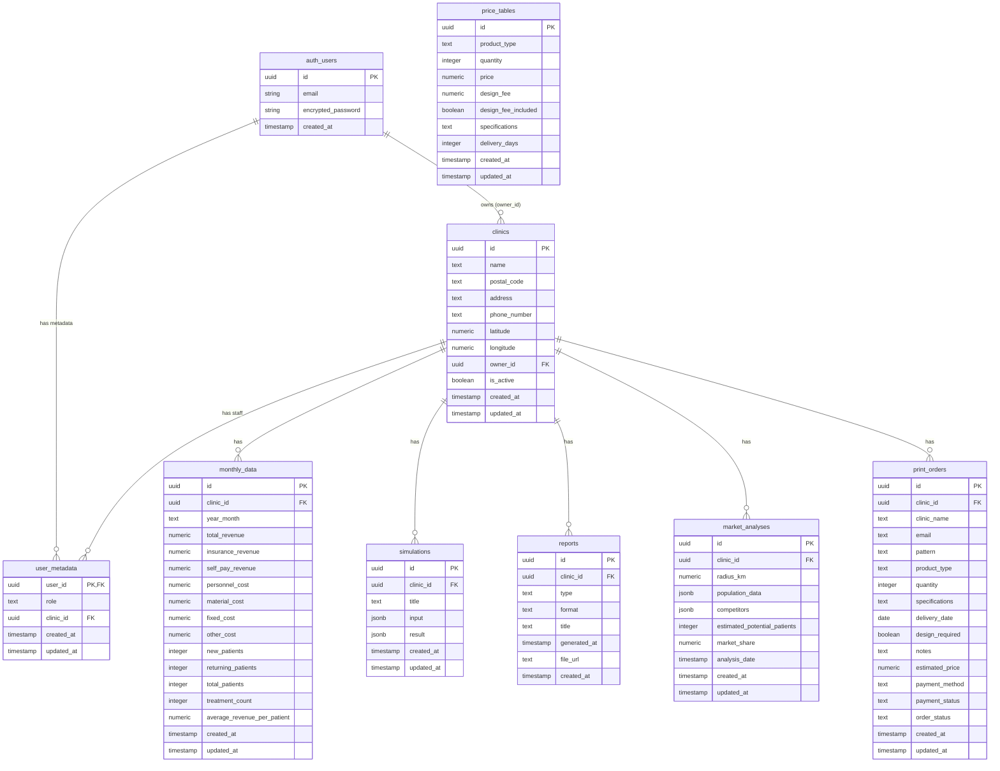

# MA-Pilot データベーススキーマ

## 概要

MA-Pilotでは、Supabase（PostgreSQL 15）を使用してデータを管理しています。このドキュメントでは、全テーブルの詳細仕様、ER図、RLS（Row Level Security）ポリシーを記載しています。

### データベース情報

- **DBMS**: PostgreSQL 15（Supabase）
- **認証**: Supabase Auth（JWT）
- **セキュリティ**: Row Level Security（RLS）有効
- **文字コード**: UTF-8

---

## ER図（Entity Relationship Diagram）



---

## 1. clinics テーブル

医院の基本情報を管理します。

### カラム定義

| カラム名 | 型 | NULL | デフォルト | 説明 |
|---------|-----|------|----------|------|
| id | UUID | NO | gen_random_uuid() | 医院ID（主キー） |
| name | TEXT | NO | - | 医院名 |
| postal_code | TEXT | NO | - | 郵便番号 |
| address | TEXT | NO | - | 住所 |
| phone_number | TEXT | NO | - | 電話番号 |
| latitude | NUMERIC(10,7) | NO | - | 緯度 |
| longitude | NUMERIC(10,7) | NO | - | 経度 |
| owner_id | UUID | NO | - | オーナーユーザーID（auth.users外部キー） |
| is_active | BOOLEAN | NO | true | 有効フラグ |
| created_at | TIMESTAMP | NO | now() | 作成日時 |
| updated_at | TIMESTAMP | NO | now() | 更新日時 |

### インデックス

- `idx_clinics_owner_id` - owner_id（検索高速化）
- `idx_clinics_is_active` - is_active（アクティブ医院絞り込み）

### 制約

- **主キー**: id
- **外部キー**: owner_id → auth.users(id) ON DELETE CASCADE

---

## 2. monthly_data テーブル

月次経営データを管理します。

### カラム定義

| カラム名 | 型 | NULL | デフォルト | 説明 |
|---------|-----|------|----------|------|
| id | UUID | NO | gen_random_uuid() | 月次データID（主キー） |
| clinic_id | UUID | NO | - | 医院ID |
| year_month | TEXT | NO | - | 年月（YYYY-MM形式） |
| total_revenue | NUMERIC(12,2) | NO | 0 | 総売上 |
| insurance_revenue | NUMERIC(12,2) | NO | 0 | 保険診療売上 |
| self_pay_revenue | NUMERIC(12,2) | NO | 0 | 自費診療売上 |
| personnel_cost | NUMERIC(12,2) | NO | 0 | 人件費 |
| material_cost | NUMERIC(12,2) | NO | 0 | 材料費 |
| fixed_cost | NUMERIC(12,2) | NO | 0 | 固定費（家賃等） |
| other_cost | NUMERIC(12,2) | NO | 0 | その他経費 |
| new_patients | INTEGER | NO | 0 | 新患数 |
| returning_patients | INTEGER | NO | 0 | 再診患者数 |
| total_patients | INTEGER | NO | 0 | 総患者数 |
| treatment_count | INTEGER | NO | 0 | 治療回数 |
| average_revenue_per_patient | NUMERIC(10,2) | NO | 0 | 患者単価 |
| created_at | TIMESTAMP | NO | now() | 作成日時 |
| updated_at | TIMESTAMP | NO | now() | 更新日時 |

### インデックス

- `idx_monthly_data_clinic_id` - clinic_id
- `idx_monthly_data_year_month` - year_month

### 制約

- **主キー**: id
- **外部キー**: clinic_id → clinics(id) ON DELETE CASCADE
- **UNIQUE制約**: (clinic_id, year_month) - 同じ医院・年月の重複を防ぐ

---

## 3. simulations テーブル

経営シミュレーション結果を管理します。

### カラム定義

| カラム名 | 型 | NULL | デフォルト | 説明 |
|---------|-----|------|----------|------|
| id | UUID | NO | gen_random_uuid() | シミュレーションID（主キー） |
| clinic_id | UUID | NO | - | 医院ID |
| title | TEXT | NO | - | シミュレーションタイトル |
| input | JSONB | NO | - | 入力パラメータ（JSON） |
| result | JSONB | NO | - | 結果データ（JSON） |
| created_at | TIMESTAMP | NO | now() | 作成日時 |
| updated_at | TIMESTAMP | NO | now() | 更新日時 |

### インデックス

- `idx_simulations_clinic_id` - clinic_id

### 制約

- **主キー**: id
- **外部キー**: clinic_id → clinics(id) ON DELETE CASCADE

### input JSONB構造例

```json
{
  "target_revenue": 8000000,
  "target_profit": 2500000,
  "timeframe_months": 12,
  "current_chair_count": 5,
  "current_staff_count": 10,
  "avg_revenue_per_patient": 20000
}
```

### result JSONB構造例

```json
{
  "required_patients": 400,
  "required_chairs": 7,
  "required_staff": 14,
  "strategies": [
    {
      "category": "equipment",
      "description": "チェア2台増設",
      "cost": 5000000,
      "expected_impact": "月間患者数+30%"
    }
  ]
}
```

---

## 4. reports テーブル

生成されたレポートの履歴を管理します。

### カラム定義

| カラム名 | 型 | NULL | デフォルト | 説明 |
|---------|-----|------|----------|------|
| id | UUID | NO | gen_random_uuid() | レポートID（主キー） |
| clinic_id | UUID | NO | - | 医院ID |
| type | TEXT | NO | - | レポート種別 |
| format | TEXT | NO | - | フォーマット（pdf/csv） |
| title | TEXT | NO | - | レポートタイトル |
| generated_at | TIMESTAMP | NO | - | 生成日時 |
| file_url | TEXT | NO | - | ファイルURL（Supabase Storage） |
| created_at | TIMESTAMP | NO | now() | 作成日時 |

### インデックス

- `idx_reports_clinic_id` - clinic_id
- `idx_reports_type` - type

### 制約

- **主キー**: id
- **外部キー**: clinic_id → clinics(id) ON DELETE CASCADE
- **CHECK制約**: type IN ('monthly', 'quarterly', 'annual', 'simulation', 'market_analysis')
- **CHECK制約**: format IN ('pdf', 'csv')

---

## 5. market_analyses テーブル

診療圏分析結果を管理します。

### カラム定義

| カラム名 | 型 | NULL | デフォルト | 説明 |
|---------|-----|------|----------|------|
| id | UUID | NO | gen_random_uuid() | 分析ID（主キー） |
| clinic_id | UUID | NO | - | 医院ID |
| radius_km | NUMERIC(5,2) | NO | - | 分析半径（km） |
| population_data | JSONB | NO | - | 人口統計データ |
| competitors | JSONB | NO | '[]' | 競合医院リスト |
| estimated_potential_patients | INTEGER | NO | 0 | 潜在患者数推定 |
| market_share | NUMERIC(5,2) | NO | 0 | 市場シェア（%） |
| analysis_date | TIMESTAMP | NO | - | 分析実行日時 |
| created_at | TIMESTAMP | NO | now() | 作成日時 |
| updated_at | TIMESTAMP | NO | now() | 更新日時 |

### インデックス

- `idx_market_analyses_clinic_id` - clinic_id

### 制約

- **主キー**: id
- **外部キー**: clinic_id → clinics(id) ON DELETE CASCADE

### population_data JSONB構造例

```json
{
  "total": 50000,
  "age_groups": {
    "0-14": 5000,
    "15-64": 30000,
    "65+": 15000
  },
  "household_count": 20000,
  "avg_income": 6000000
}
```

### competitors JSONB構造例

```json
[
  {
    "name": "ABC歯科",
    "distance": 500,
    "latitude": 35.6812,
    "longitude": 139.7671
  }
]
```

---

## 6. user_metadata テーブル

Supabase Authのユーザー拡張情報を管理します。

### カラム定義

| カラム名 | 型 | NULL | デフォルト | 説明 |
|---------|-----|------|----------|------|
| user_id | UUID | NO | - | ユーザーID（主キー、auth.users外部キー） |
| role | TEXT | NO | - | 権限ロール |
| clinic_id | UUID | YES | NULL | 所属医院ID |
| created_at | TIMESTAMP | NO | now() | 作成日時 |
| updated_at | TIMESTAMP | NO | now() | 更新日時 |

### インデックス

- `idx_user_metadata_clinic_id` - clinic_id
- `idx_user_metadata_role` - role

### 制約

- **主キー**: user_id
- **外部キー**: user_id → auth.users(id) ON DELETE CASCADE
- **外部キー**: clinic_id → clinics(id) ON DELETE SET NULL
- **CHECK制約**: role IN ('system_admin', 'clinic_owner', 'clinic_editor', 'clinic_viewer')

### ロール説明

| ロール | 説明 |
|--------|------|
| system_admin | システム管理者（全医院アクセス可） |
| clinic_owner | 医院オーナー（自医院の全操作可） |
| clinic_editor | 医院編集者（自医院データの編集可） |
| clinic_viewer | 医院閲覧者（自医院データの閲覧のみ） |

---

## 7. print_orders テーブル（Phase 7追加）

印刷物注文情報を管理します。

### カラム定義

| カラム名 | 型 | NULL | デフォルト | 説明 |
|---------|-----|------|----------|------|
| id | UUID | NO | gen_random_uuid() | 注文ID（主キー） |
| clinic_id | UUID | YES | NULL | 医院ID（将来拡張用） |
| clinic_name | TEXT | NO | - | クリニック名 |
| email | TEXT | NO | - | メールアドレス |
| pattern | TEXT | NO | - | 注文パターン（consultation/reorder） |
| product_type | TEXT | YES | NULL | 商品種類 |
| quantity | INTEGER | YES | NULL | 数量 |
| specifications | TEXT | YES | NULL | 仕様詳細 |
| delivery_date | DATE | YES | NULL | 納期希望 |
| design_required | BOOLEAN | YES | NULL | デザイン要否 |
| notes | TEXT | YES | NULL | 備考 |
| estimated_price | NUMERIC(10,2) | YES | NULL | 見積もり金額 |
| payment_method | TEXT | YES | NULL | 決済方法（stripe/invoice） |
| payment_status | TEXT | YES | 'pending' | 決済状態 |
| order_status | TEXT | NO | 'submitted' | 注文状態 |
| created_at | TIMESTAMP | NO | now() | 作成日時 |
| updated_at | TIMESTAMP | NO | now() | 更新日時 |

### インデックス

- `idx_print_orders_clinic_id` - clinic_id
- `idx_print_orders_email` - email
- `idx_print_orders_order_status` - order_status

### 制約

- **主キー**: id
- **外部キー**: clinic_id → clinics(id) ON DELETE SET NULL（オプショナル）
- **CHECK制約**: pattern IN ('consultation', 'reorder')
- **CHECK制約**: payment_method IN ('stripe', 'invoice')
- **CHECK制約**: payment_status IN ('pending', 'paid', 'invoiced')
- **CHECK制約**: order_status IN ('submitted', 'confirmed', 'in_production', 'shipped', 'completed')

---

## 8. price_tables テーブル（Phase 7追加）

印刷物価格マスタを管理します。

### カラム定義

| カラム名 | 型 | NULL | デフォルト | 説明 |
|---------|-----|------|----------|------|
| id | UUID | NO | gen_random_uuid() | 価格表ID（主キー） |
| product_type | TEXT | NO | - | 商品種類 |
| quantity | INTEGER | NO | - | 数量 |
| price | NUMERIC(10,2) | NO | - | 価格 |
| design_fee | NUMERIC(10,2) | NO | 0 | デザイン費 |
| design_fee_included | BOOLEAN | NO | false | デザイン費込みフラグ |
| specifications | TEXT | YES | NULL | 仕様（チラシ流用等） |
| delivery_days | INTEGER | NO | 10 | 納期日数 |
| created_at | TIMESTAMP | NO | now() | 作成日時 |
| updated_at | TIMESTAMP | NO | now() | 更新日時 |

### インデックス

- `idx_price_tables_product_type` - product_type
- `idx_price_tables_quantity` - quantity

### 制約

- **主キー**: id
- **UNIQUE制約**: (product_type, quantity, specifications) - 重複価格防止

---

## Row Level Security（RLS）ポリシー

すべてのテーブルでRLSを有効化し、clinic_idベースのデータ分離を実装しています。

### clinicsテーブル

1. **SELECT**: 自医院 or 所属医院 or システム管理者
2. **UPDATE**: オーナー or clinic_owner以上
3. **INSERT**: システム管理者のみ

### monthly_data, simulations, reports, market_analysesテーブル

1. **SELECT**: 自医院スタッフ or システム管理者
2. **INSERT/UPDATE/DELETE**: clinic_editor以上 or システム管理者

### user_metadataテーブル

1. **SELECT**: 自分のメタデータ or システム管理者
2. **ALL**: システム管理者 or clinic_owner（同一医院内のみ）

### print_orders, price_tablesテーブル

- **RLS無効**（MVP版では認証不要のため）
- 将来的にclinic_id連携時にRLS有効化予定

---

## トリガー・関数

### update_updated_at_column()

すべてのテーブルで`updated_at`カラムを自動更新します。

```sql
CREATE OR REPLACE FUNCTION update_updated_at_column()
RETURNS TRIGGER AS $$
BEGIN
  NEW.updated_at = now();
  RETURN NEW;
END;
$$ language 'plpgsql';
```

### 適用トリガー

- update_clinics_updated_at
- update_monthly_data_updated_at
- update_simulations_updated_at
- update_market_analyses_updated_at
- update_user_metadata_updated_at
- update_print_orders_updated_at
- update_price_tables_updated_at

---

## データマイグレーション手順

### 初期セットアップ

1. Supabaseプロジェクト作成
2. SQL Editorで`backend/supabase_schema.sql`を実行
3. 管理者ユーザーを手動作成（Supabase Auth）
4. user_metadataに管理者レコード挿入

### スキーマ更新

1. 変更をローカルで`supabase_schema.sql`に反映
2. Supabase SQL Editorで実行
3. バックエンドコードの型定義を同期更新

---

## バックアップ・リストア

### 自動バックアップ

- Supabaseが毎日自動バックアップ（無料プラン: 7日間保持）

### 手動バックアップ

```bash
# Supabase CLIでダンプ
supabase db dump -f backup.sql

# リストア
supabase db reset
psql -h db.your-project.supabase.co -U postgres -d postgres -f backup.sql
```

---

**最終更新**: 2025年12月26日
